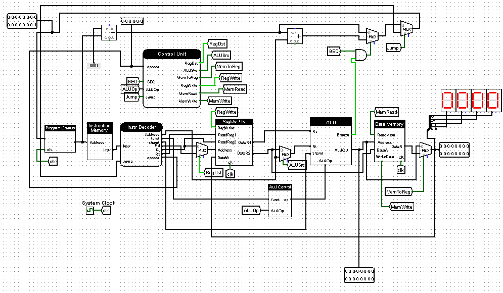

	

    A 16 bit Microporocessor Based On Our Subset of MIPS

 
	An implementation of a 16 bit microprocessor based on a subset of the MIPS Instruction set architecture in Logisim. This work is solely for academic purposes.

<h2> Motivation&#127775;</h2>	

This work was done and submitted as a course project for COE 381: Microprocessors at the Department of Computer Engineering, Kwame Nkrumah Univeristy of Science and Technology, Kumasi, Ghana. The aim of the project is to get an indepth understanding of the functioning of microporcessors and also to prepare for computer architecture and digital computer design.

<h2> Installation&#x1f4e6;</h2>	

<ol>
	<li>Clone this repo 
	<pre>git clone https://github.com/aibenStunner/mini-mips.git 
   
   cd mini-mips
	</pre>
	</li>
	<li>Install Logisim 
	Note that Logisim development is suspended indefinitely. You can however download it from <a href=http://www.cburch.com/logisim/>here</a>
	
</li>

<h2>Usage&#128187;</h2>

Once you have Logisim you are good to go!&#128522;. If you are unfamiliar with how to use logisim you can get started <a href="https://www.youtube.com/watch?v=RdnT_Ujq72E&list=PL9Tu_yD7oJURQqPEAQ78FggiDeiK7MqVb">here</a>.or glance through the presentation <a href="https://github.com/aibenStunner/mini-mips/blob/master/docs/presentation.pptx">slides</a> to gain more insights on the design and the usage.Use the <a href="https://github.com/aibenStunner/mini-mips/blob/master/test_code/fib_Decoded.txt">test files</a> to run the simulation.   
The instruction memory and data memory are ram modules. Before starting the simulation, be sure to restart the simulation.
	 
For the test: This test computes the 8th Fibonacci number and stores the result in the second memory location in the design. To run, in instruction memory, right click and select load image, from there browse to test files and select “fib.txt”.. When the test is properly loaded, simply press CTRL+T (or CMD+T on mac) to cycle through the processor. 
 Demo&#128250;</h2>	
	

	</img>
	

<h2>Contributing&#127873;</h2>
	

	Pull requests are welcome. However I have discontinued work here. I will be focusing this time to work on the complete MIPS implemenation with pipelining implemented in VHDL or Verilog check my github for more.
	

<h2>References&#x1F4D3;</h2>
	

	<ul>
		<li> <a href="https://en.wikipedia.org/wiki/MIPS_architecture">About MIPS </a></li>
		<li>  Computer Architecture: A Quantitative Approach, Fifth Edition, John L. Hennessy and David A. Patterson</li>
		<li> Computer Organization and Design The Hardware /Software Interface, John L. Hennessy and David A. Patterson</li>
		<li> Digital Design and Computer Architecture, Second Edition, David Money Harris
			Sarah L. Harris </li>
		<li> <a href="https://www.youtube.com/watch?v=CDO28Esqmcg&list=PLhwVAYxlh5dvB1MkZrcRZy6x_a2yORNAu">Bilkent University Computer Organization Course By William Sawyer</a> 
	

<h2>Licence&#128272;</h2>
	
MIT &copy; Gadri-Akrong Ebenezer Kweku

